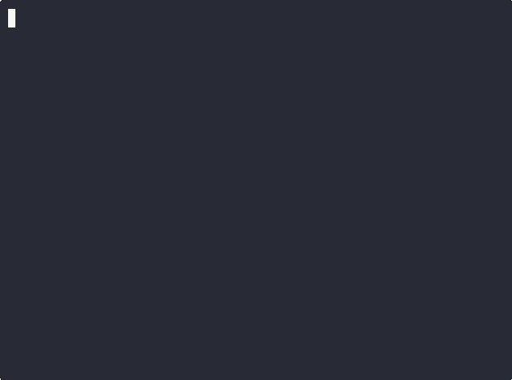

<p align="center">
  
</p>

<h1 align="center">md2cast</h1>

<p align="center">
  <strong>Markdown in. Screencast out.</strong><br>
  Convert Markdown documentation into beautiful asciinema screencasts.
</p>

<p align="center">
  <a href="https://pypi.org/project/md2cast/"></a>
  <a href="https://pypi.org/project/md2cast/"></a>
  <a href="https://github.com/markamo/md2cast/blob/main/LICENSE"></a>
  <a href="https://github.com/markamo/md2cast/stargazers"></a>
  <a href="https://md2cast.dev"></a>
</p>

<p align="center">
  <a href="#install">Install</a> &bull;
  <a href="#quick-start">Quick Start</a> &bull;
  <a href="#markdown-mapping">How it Maps</a> &bull;
  <a href="#features">Features</a> &bull;
  <a href="examples/">Examples</a> &bull;
  <a href="#pro">Pro</a> &bull;
  <a href="https://md2cast.dev">Website</a>
</p>

---

<p align="center">
  
</p>

---

Write your tutorial in Markdown. Run one command. Get a `.cast` file you can play, embed, or convert to GIF, MP4, or WebM.

## Install

```bash
pipx install md2cast
```

Or with pip in a virtual environment: `pip install md2cast`

Installs `md2cast` with **Pygments** (syntax highlighting) and **asciinema** (playback) automatically.

**Optional:**

| Tool | For | Install |
|------|-----|---------|
| [agg](https://github.com/asciinema/agg/releases) | GIF export (`--gif`) | Download binary from releases |
| [ffmpeg](https://ffmpeg.org/) | MP4/WebM export (`--mp4`, `--webm`) | `apt install ffmpeg` |
| [Pillow](https://pillow.readthedocs.io/) | Image stitching in GIFs | `pip install Pillow` |
| [Playwright](https://playwright.dev/python/) | Browser capture (Pro) | `pip install playwright && playwright install chromium` |
| [xdotool](https://github.com/jordansissel/xdotool) | GUI capture (Pro) | `apt install xdotool` |

## Quick Start

```bash
# Generate a screencast
md2cast tutorial.md                        # → tutorial.cast

# Generate a GIF (requires agg)
md2cast tutorial.md --gif                  # → tutorial.gif

# Execute commands for real output
md2cast tutorial.md --execute

# Generate HTML page with embedded players
md2cast tutorial.md --render-html

# Generate Markdown with GIFs above each code block
md2cast tutorial.md --render

# Self-contained HTML (no server needed)
md2cast tutorial.md --render-html --embed

# Split into one .cast per section
md2cast tutorial.md --split

# Render only one section
md2cast tutorial.md --section 3

# Custom terminal size
md2cast tutorial.md --cols 120 --rows 40

# Generate MP4 video (requires agg + ffmpeg)
md2cast tutorial.md --mp4                  # → tutorial.mp4

# Generate WebM video
md2cast tutorial.md --webm                 # → tutorial.webm

# Use a custom theme
md2cast tutorial.md --theme my-theme.json
```

## Markdown Mapping

Standard Markdown maps directly to screencast visuals. No DSL to learn.

| Markdown | Screencast |
|----------|-----------|
| `# Heading` | Title card (clear screen, box border) |
| `## Heading` | Section divider (clear, banner) |
| `### Heading` | Subsection label (bold) |
| Regular text | Narrated comment (dimmed `# text`) |
| ` ```bash ` | Typed command with `$` prompt |
| ` ``` ` (no lang) | Static output block |
| ` ```yaml ` etc | Syntax-highlighted static block |
| `> blockquote` | Highlighted note (yellow sidebar) |
| `` | Narration in cast; embedded in HTML/Render; stitched into GIF |
| `` | Narration in cast; `<video>` in HTML; frame in GIF |
| `[text](url)` | Clickable link in HTML output |
| `---` | Screen clear |

## Directives

HTML comment directives give per-block control without breaking normal Markdown rendering:

| Directive | Effect |
|-----------|--------|
| `<!-- exec -->` | Execute the next bash block for real output |
| `<!-- no-exec -->` | Skip execution for the next block (even with `--execute`) |
| `<!-- type-delay 0.01 -->` | Override typing speed for the next block |
| `<!-- prompt # -->` | Change prompt character (`#` for root, `>>>` for Python) |
| `<!-- output -->` | Force next ` ```bash ` block to display as static output |
| `<!-- view-exec -->` | Show commands as preview, then execute with real output |
| `<!-- pause 3 -->` | Pause for N seconds |
| `<!-- clear -->` | Clear screen (alternative to `---`) |
| `<!-- skip -->` | Skip the next block entirely |
| `<!-- browser -->` | Browser automation steps (Pro) |
| `<!-- gui -->` | Desktop GUI automation steps (Pro) |

Directives apply to the next block only and can be stacked:

````markdown
<!-- prompt # -->
<!-- type-delay 0.08 -->
```bash
apt install -y nginx
```
````

## Features

| Feature | Free | Pro |
|---------|:----:|:---:|
| All markdown directives | ✅ | ✅ |
| Cast, GIF, MP4, WebM, HTML, Render output | ✅ | ✅ |
| Execute mode (real output) | ✅ | ✅ |
| Image & video embedding | ✅ | ✅ |
| Image stitching into GIFs (Pillow) | ✅ | ✅ |
| Customizable heading formats | ✅ | ✅ |
| Custom themes & syntax highlighting | ✅ | ✅ |
| Split mode & section select | ✅ | ✅ |
| Auto-sized terminal rows | ✅ | ✅ |
| Self-contained HTML (`--embed`) | ✅ | ✅ |
| Up to 15 code blocks / 10 sections | ✅ | ♾️ Unlimited |
| GIF watermark | md2cast | ✅ None |
| Browser capture (Playwright) | — | ✅ |
| GUI desktop capture | — | ✅ |
| AI enhancement (coming soon) | — | ✅ |

## Themes

Customize colors, terminal size, timing, and player settings with a JSON config file.

```bash
# Generate a default theme
md2cast --init-theme > md2cast.json
```

<details>
<summary><strong>Theme structure</strong></summary>

```json
{
  "terminal": {
    "cols": 110,
    "rows": 35,
    "shell": "/bin/bash",
    "env": { "TERM": "xterm-256color" }
  },
  "player": {
    "theme": "monokai",
    "font_family": "JetBrains Mono, Fira Code, Menlo, monospace",
    "font_size": 16,
    "idle_time_limit": 3
  },
  "colors": {
    "prompt": "green",
    "title_border": "cyan",
    "title_text": "bold",
    "narration": "dim",
    "quote": "yellow",
    "syntax_highlight": true,
    "highlight_style": "monokai"
  },
  "timing": {
    "type_delay": 0.03,
    "cmd_pause": 0.8,
    "output_pause": 1.5,
    "section_pause": 2.0
  },
  "headings": {
    "h1": { "style": "box", "border": "double", "width": 60, "align": "left", "padding": 1, "clear": true },
    "h2": { "style": "box", "border": "single", "width": "auto", "align": "center", "padding": 0, "clear": true },
    "h3": { "style": "text", "clear": false, "prefix": "", "suffix": "", "align": "left" }
  },
  "render": {
    "background": "#1a1b26",
    "foreground": "#c0caf5",
    "accent": "#7aa2f7",
    "font_family": "Inter, system-ui, sans-serif",
    "code_font": "JetBrains Mono, Fira Code, monospace",
    "max_width": "900px",
    "image_max_width": "100%",
    "image_border_radius": "8px",
    "image_shadow": true,
    "video_autoplay": false,
    "video_controls": true,
    "video_loop": false
  }
}
```

</details>

**Auto-discovery:** If no `--theme` flag is given, md2cast looks for `md2cast.json`, `.md2cast.json`, or `~/.config/md2cast/theme.json`.

**Color formats:** Named (`"green"`, `"bold"`), hex (`"#ff6600"`), 256-color (`"256:208"`), raw SGR (`"1;38;5;214"`), or empty (`""` for default).

**Syntax highlighting:** Powered by [Pygments](https://pygments.org/). Use any style — `monokai`, `dracula`, `solarized-dark`, `nord`, `one-dark`, etc.

**Heading formats:** Control how `#`, `##`, `###` render in the cast. Styles: `box` (bordered), `line` (underline), `text` (plain bold), `none` (hidden). Border types for box style: `double` (╔═╗), `single` (┌─┐), `heavy` (┏━┓), `rounded` (╭─╮).

**Render config:** Customize the `--render-html` output — colors, fonts, max width, image styling, and video player options.

## Render Modes

### Render Markdown (`--render`)

Generates a new Markdown file with GIF screencasts embedded above each code block:

```bash
md2cast tutorial.md --render
md2cast tutorial.md --render --execute -C /path/to/project
```

### Render HTML (`--render-html`)

Generates a self-contained HTML page with interactive asciinema players:

```bash
md2cast tutorial.md --render-html
md2cast tutorial.md --render-html --embed    # single file, no assets dir
md2cast tutorial.md --render-html --execute  # with real command output
```

## Pro

**md2cast Pro** adds browser capture, GUI automation, unlimited blocks, and watermark-free GIFs.

<details>
<summary><strong>Browser Capture</strong> — Playwright integration</summary>

````markdown
<!-- browser -->
```steps
open https://localhost:3000/dashboard
wait .dashboard-loaded
screenshot dashboard
scroll down 500
screenshot dashboard-scrolled
```
````

| Action | Example | Description |
|--------|---------|-------------|
| `open <url>` | `open https://example.com` | Navigate to URL |
| `click <selector>` | `click #login-btn` | Click element |
| `type <selector> <text>` | `type #email user@test.com` | Type into input |
| `wait <selector>` | `wait .loaded` | Wait for element |
| `screenshot [name]` | `screenshot dashboard` | Capture screenshot |
| `scroll <dir> [px]` | `scroll down 500` | Scroll page |
| `hover <selector>` | `hover .menu-item` | Hover element |
| `video start [name]` | `video start demo` | Start recording |
| `video stop` | `video stop` | Stop recording |

</details>

<details>
<summary><strong>GUI Capture</strong> — Desktop automation</summary>

````markdown
<!-- gui -->
```steps
launch code --new-window /tmp/demo
sleep 2
screenshot editor-opened
type "Hello, world!"
screenshot editor-typed
```
````

| Action | Example | Description |
|--------|---------|-------------|
| `launch <cmd>` | `launch code .` | Launch app |
| `focus <window>` | `focus "VS Code"` | Focus window by title |
| `click <x> <y>` | `click 500 300` | Click coordinates |
| `type <text>` | `type "Hello"` | Type text |
| `key <combo>` | `key ctrl+s` | Key combination |
| `screenshot [name]` | `screenshot editor` | Full screen capture |
| `screenshot --window <title>` | `screenshot --window "Firefox" browser` | Window capture |
| `screenshot --region <x>,<y> <w>x<h>` | `screenshot --region 100,100 800x600 panel` | Region capture |

</details>

Mix terminal, browser, and GUI blocks freely in one document.

Learn more at [md2cast.dev](https://md2cast.dev).

---

<p align="center">
  Built by <a href="https://github.com/markamo">Mark Amo-Boateng, PhD</a><br>
  <a href="https://md2cast.dev">md2cast.dev</a> &bull; MIT License
</p>
