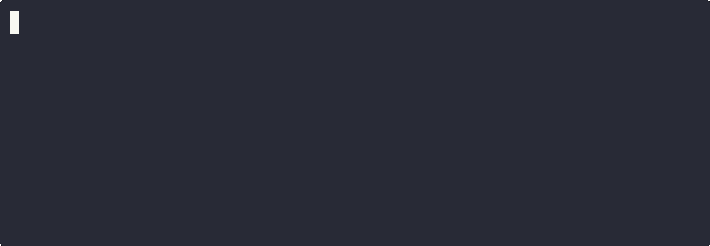

# Render Mode Test

Run with: `md2cast tests/manual/render.md --render` or `md2cast tests/manual/render.md --render-html`

## Introduction

This file tests the render pipeline — each code block should get a GIF (render) or player (render-html) above it.

## Simple Command


```bash
echo "Hello from render mode"
```

## Multiple Commands



```bash
ls -la
pwd
whoami
```

## Config Block


```yaml
apiVersion: v1
kind: Pod
metadata:
  name: test-pod
spec:
  containers:
    - name: app
      image: nginx:latest
```

## JSON Example


```json
{
  "name": "md2cast",
  "version": "0.3.0",
  "features": ["cast", "gif", "render", "html"]
}
```

## Python Code


```python
def fibonacci(n):
    a, b = 0, 1
    for _ in range(n):
        yield a
        a, b = b, a + b

for num in fibonacci(10):
    print(num, end=" ")
```

> **Note:** The render output should have a "Made with md2cast" footer at the bottom.


<p align="center"><sub>Made with <a href="https://github.com/markamo/md2cast">md2cast</a></sub></p>
